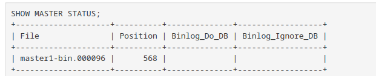
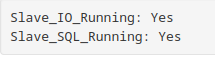

# Multi replication

## Task SQL
- [x] Dump
- [x] Master/Slave
- [x] Master/Master
- [x] indicater performance


## Task Postgreysql
- [ ] Master/Slave
- [ ] Master/Master

###  Use whiout use docker-container
- for all container get the my.cnf config in their own repetory

## Master/Slave

### How to use
- cd ./sql/master-slave
- docker-compose up -d

# Master config

## ADD Config replication (if not use docker-compose)

add in /etc/mysql/my.cnf

```bash
[mariadb]
log-bin
server-id=1
log-basename=master1
binlog-format=mixed
```

- restart service or restart container ( if service don't restart)

## Create user replication

in container 'Master'

__in mysql__

```sql
CREATE USER 'replication_user'@'%' IDENTIFIED BY 'boite';
GRANT REPLICATION SLAVE ON *.* TO 'replication_user'@'%';
```

## Binary log

__in mysql__

```sql
FLUSH TABLES WITH READ LOCK;
SHOW MASTER STATUS;
UNLOCK TABLES;
```



- get
    - file
    - Position

# Slave

in container 'Slave'

## Add config  replication  (if don't use container)

add in /etc/mysql/my.cnf

```bash
[mariadb]
server-id=<number of server>
```

- restart service or restart container ( if service don’t restart)

## Start slave

__in mysql__

```sql
CHANGE MASTER TO
  MASTER_HOST='<Host>',
  MASTER_USER='replication_user',
  MASTER_PASSWORD='boite',
  MASTER_PORT=3306,
  MASTER_LOG_FILE='<file>',
  MASTER_LOG_POS=<Possition>,
  MASTER_CONNECT_RETRY=10,
	MASTER_USE_GTID = slave_pos;

START SLAVE;
```

## Check slave is ready

__in mysql__

```sql
SHOW SLAVE STATUS \G
```


If slave_*_running is Good


# Master/Master

## How to use
- cd ./sql/master-slave
- docker-compose up -d

### warning
if docker-compose faile attached failed
- comment on the line attached (line 57 ./master-slave/docker-container.yml)


## Master1 config

### Create User

in container 'Master1'

__in mysql__

```sql
CREATE USER 'master_user1'@'%' IDENTIFIED BY 'boite';
GRANT REPLICATION SLAVE ON *.* TO 'master_user1'@'%';
FLUSH PRIVILEGES;
```

```sql
Create database badaboum;
```

### Get master status

__in mysql__

```sql
SHOW MASTER STATUS;
```


## Master2 config

in container 'Master2'

### Create User

__in mysql__

```sql
CREATE USER 'master_user1'@'%' IDENTIFIED BY 'boite';
GRANT REPLICATION SLAVE ON *.* TO 'master_user1'@'%';
FLUSH PRIVILEGES;
```

## Create database

__in mysql__

```sql
Create database badaboum;
```

### Master 2 slave

__in mysql__

```sql
STOP SLAVE;
CHANGE MASTER TO MASTER_HOST = "SQL-MASTER01",
MASTER_USER = "master_user1",
MASTER_PASSWORD = "boite",
MASTER_PORT=3306,
MASTER_LOG_FILE = "<file>",
MASTER_LOG_POS = <Position>,
MASTER_CONNECT_RETRY=10;

START SLAVE;
```

### Get Master status

__in mysql__

```sql
SHOW MASTER STATUS;
```


## Master1 slave config

__in mysql__

```sql
STOP SLAVE;

CHANGE MASTER TO MASTER_HOST = "SQL-MASTER02",
MASTER_USER = "master_user1",
MASTER_PASSWORD = "boite",
MASTER_PORT=3306,
MASTER_LOG_FILE = "<file>",
MASTER_LOG_POS = <Position>,
MASTER_CONNECT_RETRY=10;

START SLAVE;
```

### Check config

__in mysql__

```sql
show slave status\G
```


# Importante data


## List

- TOTAL_CONNECTIONS
- CONCURRENT_CONNECTIONS
- BUSY_TIME
- CPU_TIME
- ROWS_SENT
- REQUEST_TIME

## Config to get indicater


## Config my.cnf
in /etc/mysql/my.cnf add

```bash
[mariadb]
userstat = 1
plugin_load_add = query_response_time
slow_query_log
slow_query_log_file=/var/log/mysql/mariadb-slow.log
long_query_time=5.0
log_queries_not_using_indexes=ON
min_examined_row_limit=100000
log_slow_admin_statements=ON
```
and retart service mariadb


### Add variable

__in mysql__

```sql
INSTALL SONAME 'query_response_time';
SET GLOBAL userstat=1;
SET GLOBAL slow_query_log_file 'mariadb-slow.log';
SET GLOBAL long_query_time=5.0;
```

### Show statistics

__in mysql__

```sql
SELECT * FROM INFORMATION_SCHEMA.USER_STATISTICS\G
SELECT * FROM INFORMATION_SCHEMA.QUERY_RESPONSE_TIME;
```

### FILE LOG

__bash__

```bash
cat /var/log/mysql/mariadb-slow.log
```
